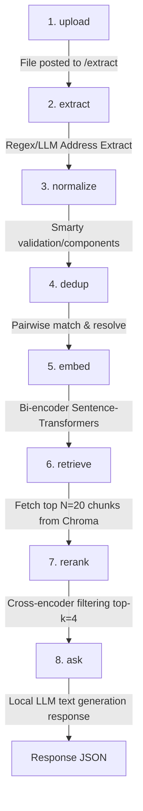

# Address Registry & Document RAG Q&A System

This project implements a secure, local, and fully-featured document Q&A (RAG) system integrated with a deterministic and LLM-assisted address extraction registry.

---

## 🏛️ System Architecture Sketch

The following diagram illustrates the sequential pipeline:
**upload → extract → normalize → dedup → embed → retrieve → rerank → ask**



---

## ✨ Advanced RAG Features

This RAG system implements state-of-the-art retrieval and extraction features:
1. **Reranker (CrossEncoder)**: Pairs queries with bi-encoder candidates (top 20) and ranks them using `cross-encoder/ms-marco-MiniLM-L6-v2` down to the top-4 chunks, dramatically improving MRR.
2. **Refusal Threshold Guardrail**: Chunks with a CrossEncoder score below `-6.0` are filtered out. If no high-quality chunks exist, the pipeline automatically returns a refusal.
3. **Factual Prompt Constraints**: System prompts and explicit user reminders enforce strict alignment to the context, eliminating model hallucinations (such as assigning sign-off names like "The Accounts Team" to role queries like "CEO").
4. **Query Rewriting (Expansion)**: Leverages the local LLM to optimize short or ambiguous user queries before vector index search, boosting retrieval recall.
5. **Scorecard Evaluation**: Includes validation scripts to measure **Recall@4**, **MRR (Mean Reciprocal Rank)**, **Answer Accuracy (Keyphrase match)**, and **Refusal Rate** on unanswerable questions.
6. **Layout & Context Optimization**:
   - **Context Preservation**: Prevents splitting document files under 2,000 characters (including invoices and letters) to keep relevant data together.
   - **Space-Collapsing Preprocessing**: Collapses multiple consecutive spaces line-by-line in retrieved text before prompt building to prevent the local LLM from misinterpreting tabular layouts.

---

## 🚀 Getting Started

### 1. Create and Activate Virtual Environment
```bash
python -m venv venv
.\venv\Scripts\activate
```

### 2. Install Pinned Dependencies
```bash
pip install -r requirements.txt
```

### 3. Run the Unit Test Suite
To run the full suite of unit tests with a fresh, isolated temporary database per test and mocked LLM generation (runs fully offline, no HF token or model download required):
```bash
pytest
```

### 4. Run the Corpus Demonstration
To reset the database/vector store, ingest all files in the corpus, print registry statistics, and query the system with three sample RAG questions:
```bash
python demo.py
```

### 5. Run Scorecard Evaluation
To evaluate RAG metrics (recall, MRR, answer accuracy, refusal rate) on the evaluation set:
```bash
python evaluate.py
```

### 6. Run the Server Locally
To start the FastAPI web server locally:
```bash
uvicorn main:app --host 127.0.0.1 --port 8000 --reload
```
Once the server is running:
- **Interactive UI (GET /ask)**: Open `http://127.0.0.1:8000/ask` in your browser to ask questions and view citations.
- **Swagger Documentation**: View all API routes at `http://127.0.0.1:8000/docs`.
