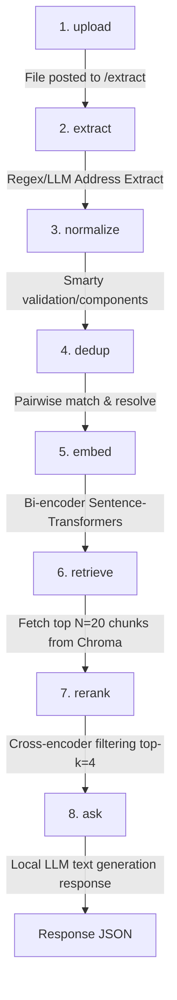

# Address Registry & Document RAG Q&A System

This project implements a secure, local, and fully-featured document Q&A (RAG) system integrated with a deterministic and LLM-assisted address extraction registry.

---

## 🏛️ System Architecture Sketch

The following diagram illustrates the sequential pipeline:
**upload → extract → normalize → dedup → embed → retrieve → rerank → ask**



---

## 🚀 Getting Started

### 1. Create and Activate Virtual Environment
```bash
python -m venv venv
.\venv\Scripts\activate
```

### 2. Install Pinned Dependencies
```bash
pip install -r requirements.txt
```

### 3. Run the Unit Test Suite
To run the full suite of unit tests with a fresh, isolated temporary database per test and mocked LLM generation (runs fully offline, no HF token or model download required):
```bash
pytest
```

### 4. Run the Corpus Demonstration
To reset the database/vector store, ingest all files in the corpus, print registry statistics, and query the system with three sample RAG questions:
```bash
python demo.py
```

### 5. Run the Server Locally
To start the FastAPI web server locally:
```bash
uvicorn main:app --host 127.0.0.1 --port 8000 --reload
```
Once the server is running:
- **Interactive UI (GET /ask)**: Open `http://127.0.0.1:8000/ask` in your browser to ask questions and view citations.
- **Swagger Documentation**: View all API routes at `http://127.0.0.1:8000/docs`.
