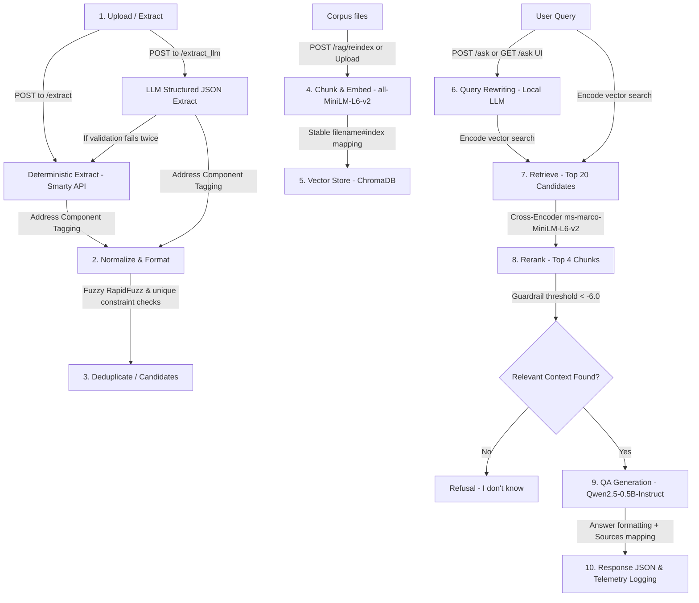

# Address Registry & Document RAG Q&A System - System Documentation

This document provides a comprehensive, file-by-file ("pin-to-pin") overview, task breakdown, and technical approach detail for the **Address Registry & Document RAG (Retrieval-Augmented Generation) Q&A System**.

---

## 🏛️ System Architecture and Flow

The application integrates two core functionalities:
1. **Deterministic & LLM-assisted Address Extraction & Registry**: For uploading documents, extracting addresses, normalizing them, and resolving duplicates.
2. **Retrieval-Augmented Generation (RAG) Q&A Pipeline**: For answering natural language questions using indexed document chunks.

### Sequential Processing Pipeline

---

## 📂 File-by-File Details (Which File Does What)

Below is a pin-to-pin explanation of each file's role in the codebase.

### Core Entry & Settings
*   **[main.py](file:///d:/surya/Week3_task/Rag_project/main.py)**: The primary FastAPI app entry point. Sets up logging, registers the router, manages application lifespan (initializing the database on startup), and handles root-level redirection to `/ask`.
*   **[app/config.py](file:///d:/surya/Week3_task/Rag_project/app/config.py)**: Environment configuration loader. Inspects `.env` for secrets, specifically checking and validating Smarty API credentials (`SMARTY_AUTH_ID` and `SMARTY_AUTH_TOKEN`) before boot.
*   **[app/logging_config.py](file:///d:/surya/Week3_task/Rag_project/app/logging_config.py)**: Configures global logging handlers. Directs logs simultaneously to standard output (`stdout`) and the local file `app.log` in UTF-8 format.

### Database & Models
*   **[app/db.py](file:///d:/surya/Week3_task/Rag_project/app/db.py)**: Handles SQLAlchemy engine creation, database sessions, and table initializations. It manages SQLite database locations dynamically (uses `test_registry.db` if the `TESTING` environment variable is active, otherwise `registry.db`). It also executes schema migrations (e.g. adding columns, indexing normalized addresses, setting up SQLite `FTS5` virtual table and sync triggers).
*   **[app/models/database_models.py](file:///d:/surya/Week3_task/Rag_project/app/models/database_models.py)**: Defines SQLAlchemy ORM models representing the physical database structure:
    *   `Document`: Represents uploaded files, status (`processed` or `failed`), content hashing, and failure details.
    *   `Address`: Normalized physical addresses.
    *   `AddressDocument`: Relational link table representing many-to-many associations between addresses and documents.
    *   `UploadEvent`: Audits rejected files (e.g., duplicates rejected due to duplicate SHA-256 or matching content hashes).
    *   `DuplicateCandidate`: Stores fuzzy-matched address duplicates with similarity scores and states (`pending`, `resolved`).
    *   `RagLog`: Stores RAG query audit trails (questions, answers, source citations, and response latencies).
*   **[app/models/address.py](file:///d:/surya/Week3_task/Rag_project/app/models/address.py)**: Standard Pydantic model representation for parsed address components and raw input, used to hold intermediate records.
*   **[app/schemas/address_schema.py](file:///d:/surya/Week3_task/Rag_project/app/schemas/address_schema.py)**: Pydantic v2 schemas (`Address` and `AddressList`) used for structured JSON parsing and strict schema validation during LLM extraction.

### Application Routing (FastAPI Controllers)
*   **[app/api/routes.py](file:///d:/surya/Week3_task/Rag_project/app/api/routes.py)**: Defines all FastAPI REST endpoints and the graphical user interface. Key routes:
    *   `POST /extract`: Ingests files deterministically using standard regex and Smarty Extract validation. Runs RAG indexing automatically.
    *   `POST /documents/{id}/extract_llm`: Opt-in endpoint invoking the LLM address extractor. Falls back to regex on validation failure.
    *   `GET /documents` & `GET /documents/{id}`: Metadata retrieval endpoints.
    *   `GET /addresses` & `GET /addresses/{id}`: Registry query tools featuring full-text-search filters.
    *   `PATCH /addresses/{id}`: Directly edits address parts, triggering dynamic normalization updates.
    *   `DELETE /addresses/{id}`: Soft-deletes address rows.
    *   `GET /duplicates` & `POST /duplicates/{id}/resolve`: Duplicate audit list and manual verification handlers.
    *   `GET /stats`: Aggregated database statistics (total documents, duplicates caught, unique count).
    *   `GET /export`: Streams registry contents into a CSV file.
    *   `POST /rag/reindex`: Walks the corpus directory and embeds document chunks in the vector index.
    *   `POST /rag/search` & `POST /ask`: Powering semantic search (with/without query rewriting & rerank) and generative QA context response.
    *   `GET /ask`: Serves a glassmorphic HTML UI designed for real-time QA interaction.

### Core Services
*   **[app/services/file_validator.py](file:///d:/surya/Week3_task/Rag_project/app/services/file_validator.py)**: Performs file assertions. Checks extensions (allowing only `.pdf`, `.txt`, `.md`), enforces size boundaries (10MB limit), and rejects empty inputs.
*   **[app/services/file_reader.py](file:///d:/surya/Week3_task/Rag_project/app/services/file_reader.py)**: Extracts text from various binary format buffers (uses `PyMuPDF`/`fitz` for PDF parsing and plain UTF-8 reading for text/markdown).
*   **[app/services/smarty_api_client.py](file:///d:/surya/Week3_task/Rag_project/app/services/smarty_api_client.py)**: Interfaces with the Smarty Extract API. Serializes requests, handles error status mappings, parses output, and implements a regex-based address parsing fallback for unverified API addresses.
*   **[app/services/address_service.py](file:///d:/surya/Week3_task/Rag_project/app/services/address_service.py)**: Coordinates file ingestion, splits text into valid chunks to bypass API limits, and executes parallel extraction requests via `ThreadPoolExecutor`.
*   **[app/services/address_normalizer.py](file:///d:/surya/Week3_task/Rag_project/app/services/address_normalizer.py)**: Sanitizes addresses (capitalizing letters, stripping non-ZIP punctuation) and normalizes terms (using a USPS abbreviation dictionary). Tags addresses into standard street, city, state, and ZIP elements using the `usaddress` parser.
*   **[app/services/database_service.py](file:///d:/surya/Week3_task/Rag_project/app/services/database_service.py)**: Manages database CRUD commands, FTS5 searching, and duplicate address matching. Compares incoming addresses using `RapidFuzz` Levenshtein similarity to flag potential duplicates and manages the "winning vs losing" address merging logic.
*   **[app/services/llm.py](file:///d:/surya/Week3_task/Rag_project/app/services/llm.py)**: Wraps a cached Hugging Face pipeline for the `Qwen/Qwen2.5-0.5B-Instruct` model. Catches load and runtime generation failures to raise a clean, custom `LLMUnavailable` exception.
*   **[app/services/llm_extractor.py](file:///d:/surya/Week3_task/Rag_project/app/services/llm_extractor.py)**: Implements LLM-assisted address extraction. Prompts the LLM with strict formatting rules to output a structured JSON schema. If the response fails parsing, it retries once with the error description appended to the prompt before falling back to the deterministic regex extractor.
*   **[app/services/rag_service.py](file:///d:/surya/Week3_task/Rag_project/app/services/rag_service.py)**: The engine of the RAG system:
    *   Loads `SentenceTransformer` and `CrossEncoder` once.
    *   Handles text chunking (400 chars, 50 overlap) and indexes documents into a persistent or ephemeral ChromaDB collection.
    *   Runs semantic vector search, converting distance metrics to a 0-1 similarity score: `score = 1.0 - distance`.
    *   Rewrites/expands queries using a local cache `query_rewrite_cache.json`.
    *   Reranks top-20 retrieved candidates using a Cross-Encoder down to top-4 chunks.
    *   Applies a Cross-Encoder threshold check (refusing if score < `-6.0`), context prompt injection rules, refusal corrections, and telemetry logging to `RagLog`.

---

## 🛠️ Complete Task-by-Task Details (Tasks 1-11)

### Task 1: Set up local LLM and wrap it
*   **Objective**: Configure a lightweight, offline-capable model (`Qwen/Qwen2.5-0.5B-Instruct`) using HF `transformers` without leaking raw pipeline exceptions.
*   **Implementation**: Cached the generation pipeline in [llm.py](file:///d:/surya/Week3_task/Rag_project/app/services/llm.py). Created a custom `LLMUnavailable` exception class to gracefully intercept load failures or runtime crashes.

### Task 2: LLM address extraction with validation and fallback
*   **Objective**: Prompt the LLM to extract addresses as strict JSON, validate against a Pydantic schema, retry on failure, and fallback to regex if still invalid.
*   **Implementation**: Programmed the extraction loop in [llm_extractor.py](file:///d:/surya/Week3_task/Rag_project/app/services/llm_extractor.py). The pipeline catches parsing errors, retries the request with feedback, and routes to [address_service.py](file:///d:/surya/Week3_task/Rag_project/app/services/address_service.py) on consecutive failures, recording the execution path (`llm`, `llm_retry`, `fallback_regex`).

### Task 3: Study RAG, chunking, recall, and test mocking
*   **Objective**: Ground theoretical understanding of RAG retrieval issues, token overlaps, search recall@k evaluation, and offline mock environments.
*   **Implementation**: Documented key metrics and mock patterns to guide subsequent module creation.

### Task 4: Chunk and embed documents into a vector store
*   **Objective**: Split text into overlapping segments, compute embeddings using `all-MiniLM-L6-v2`, and upsert into a local vector store with stable identifiers.
*   **Implementation**: Wrote chunking and indexing functions in [rag_service.py](file:///d:/surya/Week3_task/Rag_project/app/services/rag_service.py) using ChromaDB. Integrated the indexing pipeline directly into the upload handler (`/extract`) to ensure newly added documents are queryable instantly.

### Task 5: Retrieval: find the right chunks
*   **Objective**: Add search endpoints and measure bi-encoder retrieval accuracy using a `Recall@4` validation key.
*   **Implementation**: Implemented `/rag/search` returning search results scored via converted Euclidean metrics. Measured performance with an evaluation harness calculating the ratio of successful document retrievals.

### Task 6: Add a reranker (cross-encoder) and measure MRR
*   **Objective**: Implement a bi-encoder + cross-encoder hybrid pipeline (retrieve top-20 wide results, rerank down to top-4) and measure Mean Reciprocal Rank (MRR).
*   **Implementation**: Added Cross-Encoder evaluation using `cross-encoder/ms-marco-MiniLM-L6-v2` in [rag_service.py](file:///d:/surya/Week3_task/Rag_project/app/services/rag_service.py). Tracked MRR metrics in [evaluate.py](file:///d:/surya/Week3_task/Rag_project/evaluate.py) to assess score ordering improvements.

### Task 7: Full RAG: answer questions with sources
*   **Objective**: Build a complete generation pipeline with strict source citations, refusal rules, a real-time tracking table (`rag_logs`), and a basic UI.
*   **Implementation**: Configured a system prompt requiring exact context matches in [rag_service.py](file:///d:/surya/Week3_task/Rag_project/app/services/rag_service.py). Logged latencies and citations to SQLite, and exposed an interactive glassmorphic UI page.

### Task 8: Hallucination guardrail: measure refusal rate
*   **Objective**: Validate that out-of-corpus questions are correctly refused ("I don't know") rather than causing model hallucinations.
*   **Implementation**: Filtered search results when the Cross-Encoder score fell below `-6.0`, and standardized different model refusal outputs to exactly `"I don't know."`.

### Task 9: Query rewriting
*   **Objective**: Optimize vague, conversational, or brief questions using the LLM.
*   **Implementation**: Implemented query expansion in [rag_service.py](file:///d:/surya/Week3_task/Rag_project/app/services/rag_service.py) backed by a query rewrite JSON cache, allowing users to toggle query expansion via a checkbox in the UI.

### Task 10: Evaluation scorecard
*   **Objective**: Consolidate all metrics (Recall@4, MRR, Answer Accuracy, Refusal Rate) into a single report that highlights the weakest metric and diagnoses cases where retrieval succeeded but generation failed.
*   **Implementation**: Created [evaluate.py](file:///d:/surya/Week3_task/Rag_project/evaluate.py), which reads the test dataset, runs validation pipelines, and outputs a formatted scorecard.

### Task 11: Test and ship
*   **Objective**: Ensure the test suite runs quickly and completely offline using mocks.
*   **Implementation**: Wrote tests in [tests/test_app.py](file:///d:/surya/Week3_task/Rag_project/tests/test_app.py) using FastAPI's `TestClient` and `monkeypatch`. Mocks bypass network downloads and model initialization during tests.

---

## 💡 Core Technical Approach

### 1. Address Ingestion and Deduplication Tiers
*   **Tier 1: Document Integrity checks (SHA-256)**: Prevents redundant database insertions when identical files are uploaded.
*   **Tier 2: Content Hash uniqueness**: Normalizes document text (whitespace reduction, lowercasing) and computes a SHA-256 hash. If another document shares the same content hash, the system registers a duplicate upload event and skips processing.
*   **Tier 3: Strict Smarty/LLM Normalization**: Normalizes address components (capitalization, abbreviations) and uses the resulting string as a unique key for deduplication. If a normalized match exists, the new document links to the existing address ID, incrementing the duplicate count on the document record.
*   **Tier 4: Fuzzy Near-Duplicate Candidates**: Computes pairwise Levenshtein similarity using `RapidFuzz` for addresses with different normalized strings but matching city or ZIP codes. Pairs scoring $\ge 90$ are flagged as duplicate candidates for manual verification and merging.

### 2. Semantic Search and Generation
*   **Dense Passage Retrieval**: Chunks text and maps queries to vector space using the `all-MiniLM-L6-v2` bi-encoder.
*   **Hybrid Search Reranking**: Reranks the top-20 bi-encoder results using `ms-marco-MiniLM-L6-v2`. This corrects ordering errors from the bi-encoder by evaluating query-document relationships directly.
*   **Threshold Guardrail**: Rerank scores correlate with relevance. Scores below `-6.0` are rejected, protecting the model from generating hallucinated responses using irrelevant context.
*   **Prompt Constraints & Post-Processing**: Prompts instruct the model to answer only using the provided context and to output `"I don't know."` if the answer is missing. Post-processing maps model variations (e.g., "unknown", "not mentioned") to the standard refusal statement.
